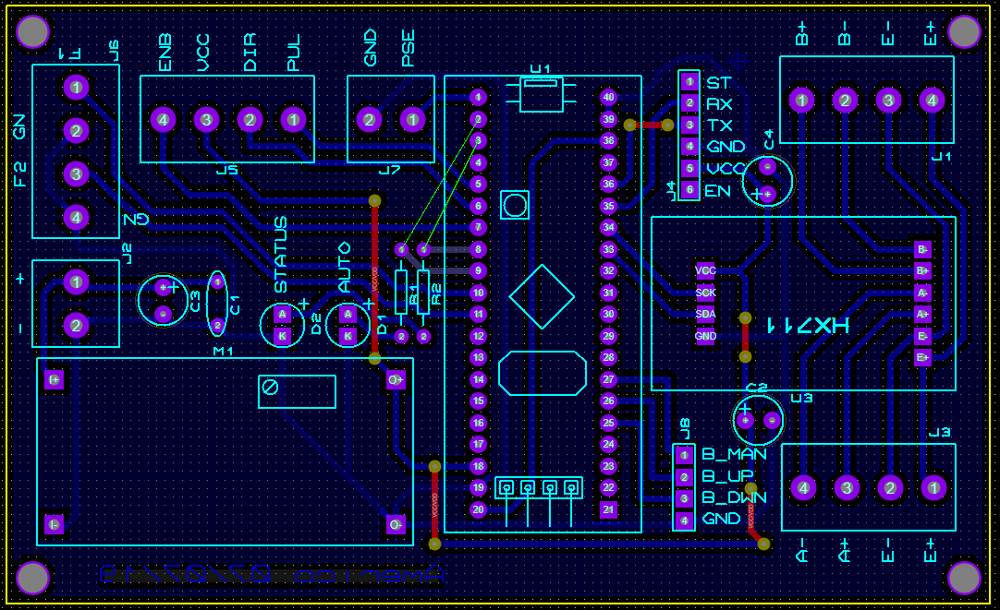
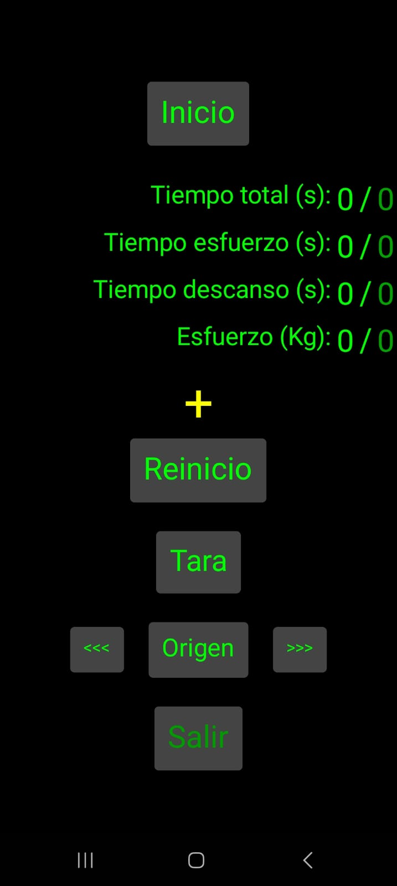
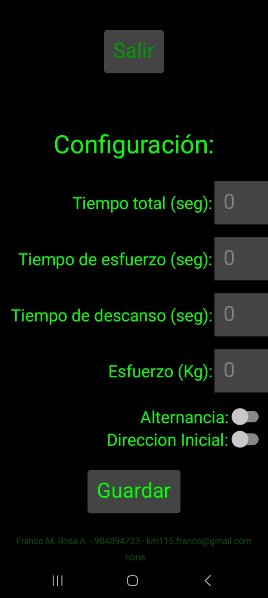

# Maquina de ejercicio estatico

> Este repositorio contiente informacion para la implementacion de una maquina de ejercio estatico.

# Circuito electronico
El circuito esta compuesto por una fuente de alimentacion de 24V que es utilizada para alimentar el driver del motor y una placa que contiene la circuiteria que incluye el microcontrolador, el dispositivo bluetooth y el adaptador de la celda de carga. El archivo que contiene el diagrama se encuentra  en `EjercicioEstatico.pdsprj`, a continuacion se colocan imagenes referenciales  

## Componentes utilizados
A continuacion se colocan algunos links referenciales de los componentes utilizados en el circuito.

`Dispositivo Bluetooth`: https://naylampmechatronics.com/inalambrico/43-modulo-bluetooth-hc05.html

`Transmisor de celda de carga`: https://naylampmechatronics.com/fuerza-peso/147-modulo-hx711-transmisor-de-celda-de-carga.html

`Puente H`: https://naylampmechatronics.com/drivers/590-driver-puente-h-bts7960-43a.html

`Actuador lineal`: https://es.aliexpress.com/item/1005006225654918.html?spm=a2g0o.productlist.main.9.2e732ac0sFy4uj&algo_pvid=0df114d6-98c2-4b8b-967c-5848da987256&aem_p4p_detail=202402290921541402976749088250000199437&utparam-url=scene%3Asearch%7Cquery_from%3A&search_p4p_id=202402290921541402976749088250000199437_1

`Celda de carga de 500Kg`: https://es.aliexpress.com/item/1005006457480870.html?spm=a2g0o.productlist.main.1.5478657eVRNanO&algo_pvid=77e6ce9d-28d8-4f2b-8936-49a7fcb54bcd&utparam-url=scene%3Asearch%7Cquery_from%3A

# Codigo de microcontrolador
La logica de control se encuentra en el archivo `static.ino` , el microcontrolador utilizado es un STM32F103 conocido como `bluepill` el codigo tiene como dependencia una libreria para la lectura de celdas de carga ubicada en la carpeta `src/HX711` para compilar cualquier cambio realizado en el codigo se puede usar el comando `bash compile.sh`

## Funcionamiento

El código se utiliza para controlar el movimiento de un actuador lineal que ejecuta un movimiento dependiendo de las mediciones de la celda de carga (fuerza ejercida) o el estado en el que se encuentre el programa
A continuación, se presenta un desglose del código:

### Librerias incluidas:

El código incluye bibliotecas para interactuar con la báscula (HX711.h) y la comunicación serie (Serial).

### Funciones definidas en el codigo

`gpio_config`: Configura los pines para entrada y salida.

`interrupt_config`: Configura una interrupción de temporizador para ejecutar una función cada milisegundo.

`serial_config`: Inicializa la comunicación serie para enviar y recibir datos.

`scale_config`: Configura la báscula (celda de carga) para diferentes factores de ganancia y escala para obtener lecturas precisas.

`sensor_active`: Comprueba si un sensor específico (interruptor de límite) está presionado (activo bajo).

`setup`: Se ejecuta una vez al principio, llamando a todas las funciones de configuración.

`read_commands`: Lee datos de los puertos serie y los almacena en un búfer.

`tic`: Alterna un LED (para indicar que el programa se encuentra en ejecucion).

`loop`: El bucle principal que se ejecuta continuamente, llamando a otras funciones.

`read_scales`: Lee la báscula y calcula el esfuerzo en función del factor de ganancia y escala elegido.

`display_values`: Imprime información diversa en los puertos serie, incluido el estado, el esfuerzo, los temporizadores y los comandos recibidos.

`processingRemoteData`: Procesa los comandos recibidos almacenándolos en un búfer y buscando palabras clave específicas para activar acciones.

`comparator`: Compara el búfer de datos recibido con comandos predefinidos y establece la variable command en consecuencia.

`findCommand`: Comprueba si el búfer de datos recibido comienza con una cadena de comando específica.

`getConfig`: Analiza una cadena de configuración recibida y actualiza las variables correspondientes.

`string2int`: Convierte una cadena del búfer en un valor entero.

`disable_motor`: Desactiva el motor configurando el pin de habilitación en bajo.

`enable_motor`: Activa el motor configurando el pin de habilitación en alto.

`move_up`: Intenta mover el dispositivo hacia arriba, deteniéndose si se presiona el interruptor de límite superior.

`move_down`: Intenta mover el dispositivo hacia abajo, deteniéndose si se presiona el interruptor de límite inferior.

`one_ms`: Esta función se llama cada milisegundo por la interrupción del temporizador. Controla el comportamiento del dispositivo en función del estado actual y los comandos recibidos. 

Actualiza los temporizadores, comprueba los estados de los sensores, mueve el motor y maneja las transiciones de estado.

En general, el código implementa una máquina de estados que controla el dispositivo en función de los comandos recibidos y las lecturas de los sensores. El dispositivo puede estar en varios estados, incluyendo inactivo, funcionando (con fases de esfuerzo y descanso), esperando un comando de inicio, calibrando el origen y ajustando el peso de tara.

# Aplicacion para configuracion
Para interactuar con la maquina, configurar los tiempos de esfuerzo, descanso, y visualizar la informacion de tiempos y celda de carga se hace uso de una aplicacion para celulares que se comunica a traves de bluetooth con el circuito electronico.
La aplicacion fue desarrollada en APP Inventor y se encuentra en el archivo `EjercicioEstatico.apk` tambien se puede acceder al codigo de bloques e interfaz de usuario a traves del siguiente link:   https://gallery.appinventor.mit.edu/?galleryid=3e9a8412-28bc-4971-812a-cbfe65445df9

## Funcionamiento
Como primer paso es necesario vincular el dispositivo bluetooth del circuito electronico con el telefono mobil utilizando la interfaz de vinculacion del telefono mobil.

Al ejecutar la aplicacion `EjercicioEstatico` el programa buscara el `bluetooth` corrrespondiente al circuito electronico, en caso de no encontrarse o cuando el circuito electronico se encuentre apagado la aplicacion se cerrara mostrando un mensaje de error.

Si la conexion fue satisfactoria, la aplicacion mostrara una vista que contiente los controles principales y al desplazar la vista hacia abajo se podran ver los controles de configuracion.

### Vista principal

Presione `Inicio` para iniciar el ejercicio.
Presione `Reinicio` para reiniciar el ejercicio.
Presione `Tara` para realizar la calibracion de la celda de carga y configurar el valor actual como zero.

Los botones `<<<` `Origen` `>>>` se utilizan para el control manual del actuador lineal

Los textos `Tiempo Total, Tiempo esfuerzo, Tiempo descanso y Esfuerzo` indican los valores actuales versus los configurados en la vista de configuracion

El boton `Salir` cierra el programa y desconecta la comunicacion con el circuito electronico

### Vista configuracion

En esta vista se ajustan los tiempos para el esfuerzo y el descanso en la aplicacion, el tiempo total es el tiempo que la maquina esta en funcionamiento, la maquina se detendra cuando haya transcurrido el tiempo total.

Los tiempos y el peso del esfuerzo en esta pagina seran utilizados por el programa principal despues de presionar el boton `Guardar`. 

El interruptor de alternancia `Alternancia` indica si el esfuerzo se realizara en una direccion.

El interruptor de `Direccion inicial` configura la direccion inicial del movimiento (hacia arriba o hacia abajo)